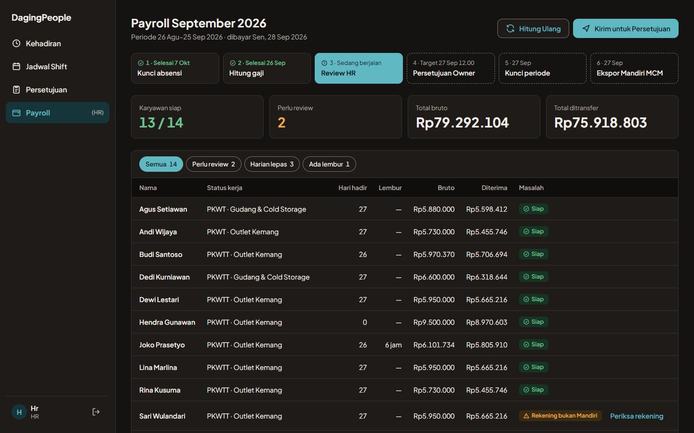
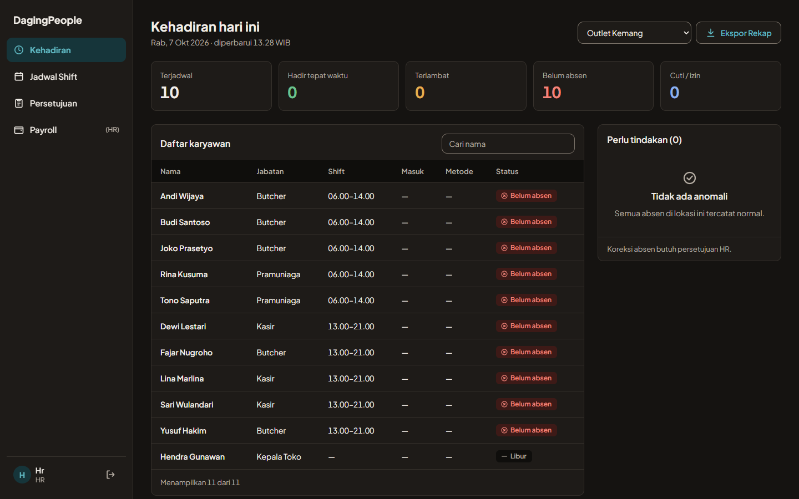
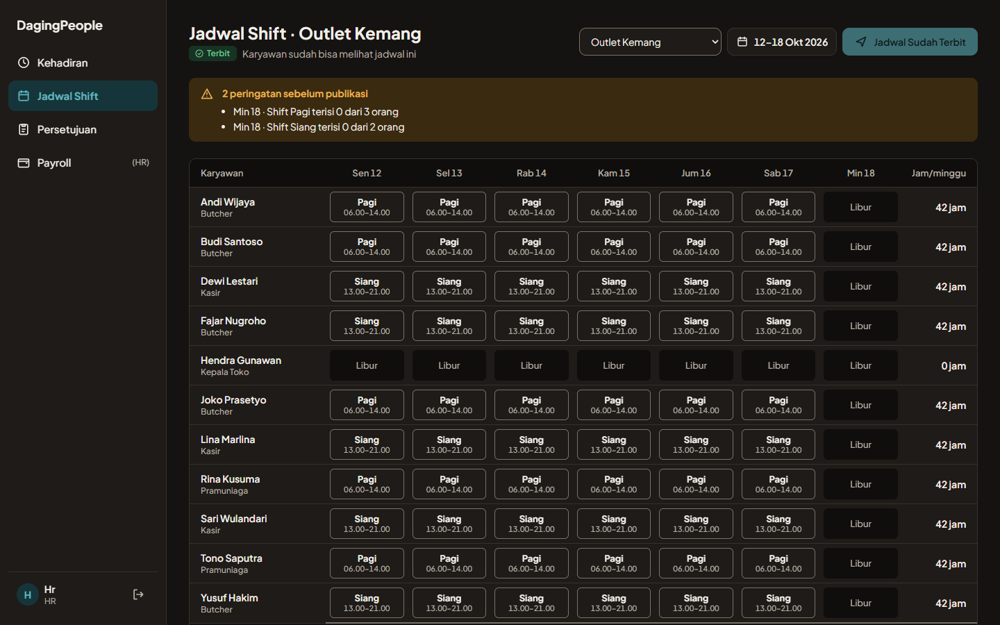
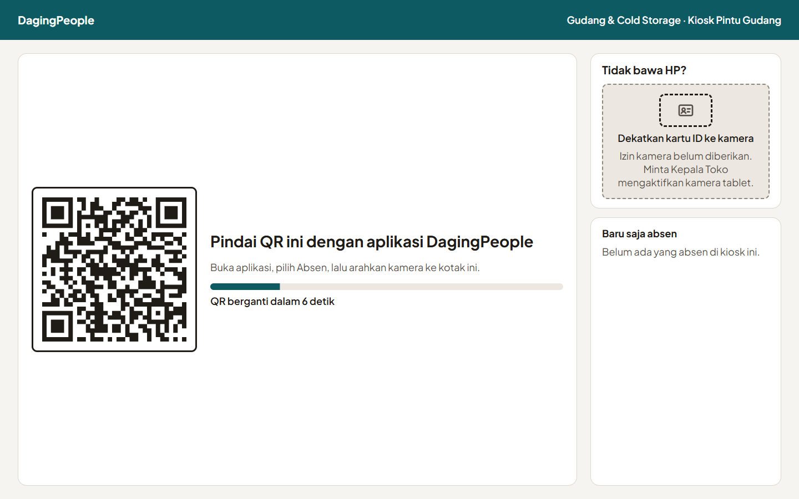
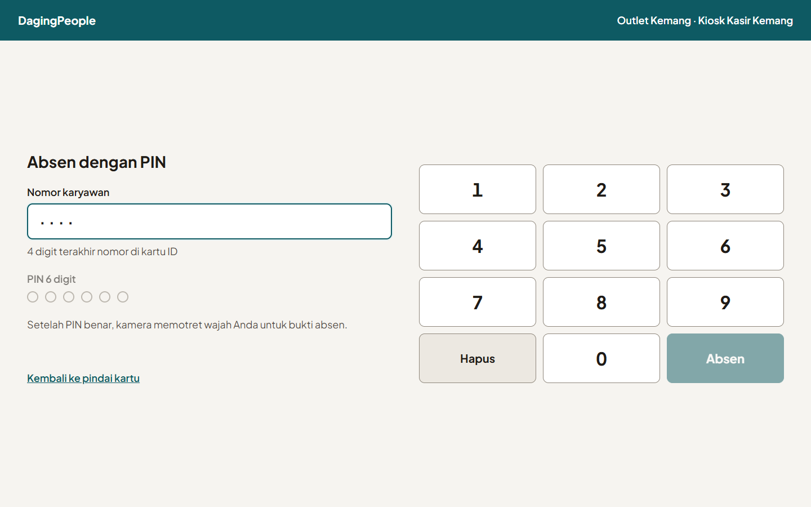
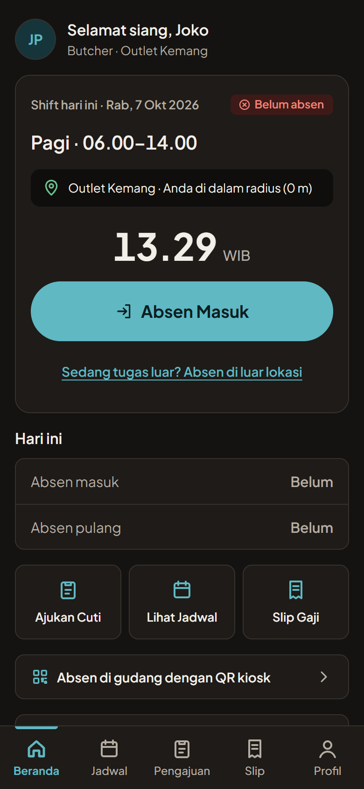

# DagingPeople

Sistem HR untuk jaringan toko daging dengan outlet dan gudang cold storage. Isinya absensi yang sulit dititipkan,
jadwal shift, cuti, persetujuan berjenjang, dan payroll yang menghitung PPh 21, BPJS, dan lembur sesuai aturan
Indonesia. Satu monorepo berisi web admin, kiosk absensi, aplikasi karyawan, dan API.

**Demo:** [dagingpeople-hris.vercel.app](https://dagingpeople-hris.vercel.app) · masuk dengan `hr@dagingprima.co.id`
dan sandi `Demo#2026`. Semua data di demo fiktif dan bisa diubah siapa saja.



## Kenapa dibuat

Toko daging punya masalah HR yang tidak tertangani spreadsheet. Karyawan tersebar di outlet dan gudang dengan shift
mulai jam 3 pagi. Titip absen gampang dilakukan. Gaji karyawan harian, kontrak, dan tetap dihitung dengan aturan
berbeda, lalu PPh 21 skema TER yang berlaku sejak 2024 menambah satu lapisan lagi. Kesalahan kecil di payroll
langsung jadi masalah kepercayaan.

## Yang bisa dilakukan

| Peran | Fitur |
| --- | --- |
| Karyawan | Absen lewat HP dengan GPS dan selfie, absen gudang dengan memindai QR kiosk, lihat jadwal, ajukan cuti, buka slip gaji |
| Kepala Toko | Pantau kehadiran outlet hari ini, susun dan terbitkan jadwal shift, setujui cuti dan tugas luar |
| HR | Semua lokasi, koreksi absen, hitung payroll, ajukan ke Owner |
| Owner & Finance | Setujui payroll, ekspor file transfer Mandiri |
| Tablet kiosk | Absen dengan kartu ID, PIN, atau QR dinamis untuk karyawan tanpa HP |

<table>
  <tr>
    <td></td>
    <td></td>
  </tr>
  <tr>
    <td></td>
    <td></td>
  </tr>
</table>



## Bagian yang paling menarik secara teknis

**Payroll engine sebagai pure function.** `packages/payroll-engine` tidak menyentuh database. Input masuk, hasil
keluar, dan hash input/output disimpan supaya perhitungan bisa diulang dan dibuktikan sama. Aturan pajak dan BPJS ada
di RuleSet berversi, jadi perubahan tarif tahun depan tidak menulis ulang riwayat. Ada dua jenis uji. Golden case
mencocokkan hasil dengan hitungan manual, misalnya gaji bersih Joko di demo Rp5.805.910. Uji properti menjalankan
500 input acak dan memeriksa aturan yang harus selalu benar, seperti bruto pajak sama dengan bruto tunai ditambah
iuran pemberi kerja.

**Absensi yang sulit dicurangi.** Absen di luar radius lokasi ditolak, kecuali karyawan mengisi alasan tugas luar
untuk disetujui Kepala Toko. Lokasi palsu ditolak tetapi tetap tercatat untuk audit. QR kiosk gudang berganti setiap
30 detik dan ditandatangani HMAC dengan gaya TOTP, jadi kiosk tetap bisa menampilkan QR saat offline. Absen offline
lebih dari 12 jam masuk antrean review. Setiap absen membawa `clientUuid` sehingga kiriman ulang dari HP tidak
pernah tercatat dua kali.

**Hak akses dicek di lapisan service, bukan di controller.** Endpoint tanpa deklarasi akses otomatis ditolak.
Peran dibaca ulang dari database setiap request, jadi akun yang dinonaktifkan langsung kehilangan akses walaupun
tokennya masih berlaku. Kepala Toko hanya melihat lokasinya, data gaji hanya untuk HR, Finance, dan Owner, dan
tidak ada yang bisa menyetujui pengajuannya sendiri.

**Data sensitif.** NIK dan nomor rekening dienkripsi AES-256-GCM. Keunikan NIK dicek lewat blind index HMAC, tanpa
menyimpan NIK polos. Audit log memakai rantai hash, dan trigger database membekukan payroll yang sudah disetujui
sehingga angkanya tidak bisa diubah diam-diam.

**Bug race condition di batas percobaan login.** Review keamanan menemukan bahwa batas 5x salah sandi bisa
dilewati. Kodenya membaca hitungan kegagalan, memeriksa sandi, lalu menulis hitungan baru. Dua puluh request paralel
semuanya membaca hitungan lama, dan akun tidak pernah terkunci. Perbaikannya memesan jatah percobaan dengan satu
`UPDATE ... RETURNING` atomik sebelum sandi diperiksa. Setelah itu, dari 20 request paralel hanya 5 yang diperiksa.
PIN kiosk punya pola yang sama dan diperbaiki dengan cara yang sama. Keduanya kini punya uji regresi. Catatan
lengkap review ada di [`docs/SECURITY-REVIEW.md`](docs/SECURITY-REVIEW.md).

**Satu kontrak untuk mock dan API.** Semua layar memanggil `HrisClient`. Implementasi mock dipakai untuk demo dan
desain, implementasi HTTP untuk produksi, dan tidak ada komponen layar yang tahu bedanya. Daftar endpoint ditulis
sekali di `packages/api/src/routes.ts`, lalu dibaca oleh klien frontend dan controller NestJS. Satu uji memastikan
keduanya tidak pernah berbeda.

## Stack

| Bagian | Teknologi |
| --- | --- |
| Web admin & kiosk | Next.js 15 App Router, React 19, CSP dengan nonce per request |
| Aplikasi karyawan | React 19, Vite, Capacitor 7 untuk Android dan iOS |
| API | NestJS modular monolith, PostgreSQL, pg-boss untuk job terjadwal tanpa Redis, Zod untuk validasi |
| Payroll | TypeScript murni, diuji dengan `node:test` |
| Deploy | Vercel di Singapura untuk web, Railway di Singapura untuk API dan Postgres, image Docker yang menjalankan migrasi saat start |

## Uji

```bash
npm run test:engine   # 35 uji payroll engine
npm run test:api      # 62 uji service & e2e terhadap Postgres sungguhan, satu database per file uji
```

Uji API tidak memakai mock database. Setiap file uji mendapat salinan database yang sudah dimigrasi dan diisi data,
dengan "hari ini" dikunci ke Rabu, 7 Oktober 2026 pukul 05.52 WIB.

## Menjalankan di lokal

```bash
npm install
npm run dev:web        # http://localhost:3000, memakai data contoh
```

Langkah lengkap dengan API dan Postgres ada di [`docs/DEVELOPMENT.md`](docs/DEVELOPMENT.md). Deploy produksi ada di
[`docs/DEPLOY.md`](docs/DEPLOY.md).

## Yang belum selesai

Plugin native untuk deteksi lokasi palsu di level perangkat dan penyimpanan token di Keychain/Keystore belum dibuat.
Alur payroll di web baru sampai tahap "Kirim untuk Persetujuan". 2FA untuk akun HR, Finance, dan Owner juga belum
ada, padahal akun itu bisa melihat gaji seluruh karyawan. Daftar lengkapnya ada di
[`docs/DEVELOPMENT.md`](docs/DEVELOPMENT.md#pekerjaan-lanjutan).
